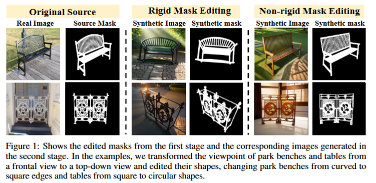
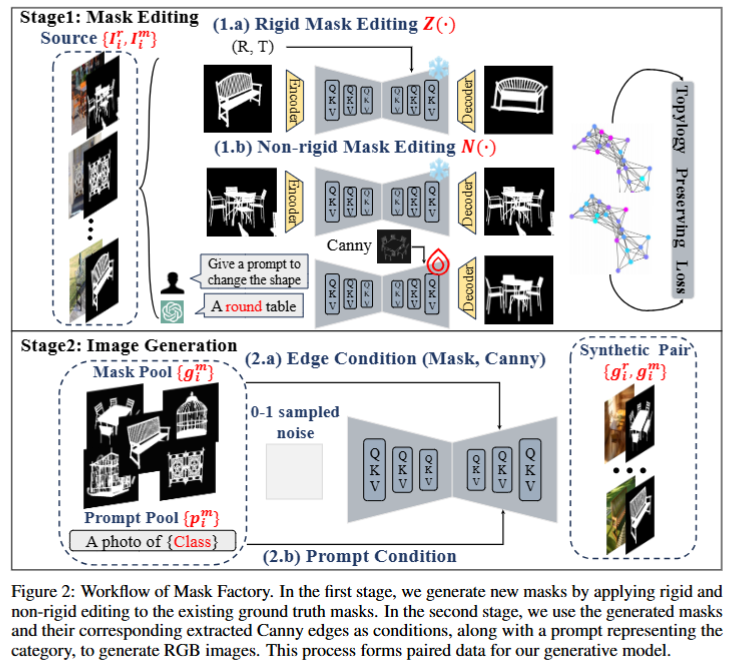

# MaskFactory
This repository provides the implementation of the NeurIPS24 paper [Mask Factory](https://openreview.net/pdf?id=iM5i289eqt), a novel approach for generating high-quality synthetic datasets for **Dichotomous Image Segmentation (DIS)** tasks. This method combines rigid mask editing and non-rigid mask editing to generate diverse and accurate synthetic masks, which are then used to produce corresponding high-resolution images.

> **MaskFactory: Towards High-quality Synthetic Data Generation For Dichotomous Image Segmentation**  
> Haotian Qian†, Yinda Chen†, Shengtao Lou, Fahad Shahbaz Khan, Xiaogang Jin, Deng-Ping Fan\*
>
> † Equal contribution




---

## 🚀 News

- **2024.10** 🎉 Our paper has been accepted by **NeurIPS 2024**!  
- **2024.11** 💻 We have open-sourced the **core code** of MaskFactory!  
- **2024.12** 📄 The **arXiv version** of our paper is now available: [arxiv:2412.19080](https://arxiv.org/pdf/2412.19080)  
- **2025.02** 📦 The **generated dataset** is now open-source on Hugging Face: [MaskFactory Dataset](https://huggingface.co/datasets/cyd0806/MaskFactory/tree/main)  
- **2025.02** 🏆 The **official NeurIPS version** of our paper is now published: [NeurIPS 2024 Proceedings](https://proceedings.neurips.cc/paper_files/paper/2024/file/7aad0cdc7e140778ad944f17a266e1bc-Paper-Conference.pdf)  
- **Future Plans** 🔍 We are in discussions with foundational model authors to obtain permission for **secondary distribution** of relevant models, enabling users to run MaskFactory more conveniently. Stay tuned!

---

## Introduction

**Dichotomous Image Segmentation (DIS)** is a critical task in various computer vision applications, requiring highly precise annotations. Traditional dataset creation methods are labor-intensive, costly, and require extensive domain expertise. Although using synthetic data for DIS is a promising solution, current generative models struggle with issues such as:
- Scene deviations  
- Noise-induced errors
- Limited training sample variability

To address these challenges, we introduce **Mask Factory**, which combines both **rigid** and **non-rigid** mask editing techniques. This approach significantly reduces the preparation time and costs while enhancing the realism and diversity of the generated datasets.

### Key Features:
- **Rigid Mask Editing**: Leveraging **Zero123** for precise viewpoint transformations under zero-shot conditions.
- **Non-rigid Mask Editing**: Utilizing **MasaCtrl** for complex shape modifications with topological consistency, achieved through adversarial training.
- **Multi-conditional Control Generation**: Generating high-resolution images paired with accurate segmentation masks using diffusion models.

---

## Dataset Preparation

To train the model effectively, you need a dataset structured as follows:

```plaintext
dataset/
├── images/
│   ├── image1.png
│   ├── image2.png
│   └── ...
└── masks/
    ├── mask1.png
    ├── mask2.png
    └── ...
```
- **images/**: Contains the real-world images.
- **masks/**: Contains the corresponding ground truth segmentation masks for each image.

Each image in the `images/` directory should have a corresponding mask in the `masks/` directory with the same filename (but different extensions). This structure is essential for training the Mask Factory model.

### Data Augmentation:
- **DIS5K Dataset**: We conduct our experiments on the **DIS5K** dataset, which contains 5,479 high-resolution images of camouflaged, salient, or meticulous objects in various backgrounds.
- The dataset is divided into three subsets:
  - **DIS-TR**: 3,000 images for training
  - **DIS-VD**: 470 images for validation 
  - **DIS-TE**: 2,000 images for testing

---

## Model Checkpoints

### Stable Diffusion v1.5 Weights

This project is based on **Stable Diffusion v1.5**. You can download the pre-trained weights from the [Hugging Face model hub](https://huggingface.co/runwayml/stable-diffusion-v1-5).

1. Download the weights and place them in a folder called `models/`:

```plaintext
models/
└── stable-diffusion-v1-5/
    └── diffusion_pytorch_model.bin
```

2. **Zero123 Weights**: 
   - You can download the pre-trained **Zero123** model from the [official repository](https://github.com/cvlab-columbia/zero123).
   - Place the downloaded weights in the `models/` directory:

```plaintext
models/
└── zero123/
    └── zero123_model.pth
```

3. **MasaCtrl Weights**:
   - **MasaCtrl** is utilized for non-rigid editing. If you have pre-trained **MasaCtrl** weights, place them in the `models/` directory:

```plaintext
models/
    └── masactrl/
        └── masactrl_model.pth
```
---

## Code Base

The repository is organized as follows:

```plaintext
.
├── dataset/                     # Store your dataset here
├── models/                      # Pre-trained models
├── output_images/              # Generated samples will be saved here
├── train.py                    # Script to run the training process
├── infer.py                    # Script for inference
├── masactrl/                   # Contains the MasaCtrl implementation
│   ├── masactrl.py
│   └── masactrl_utils.py
├── zero123/                    # Contains the Zero123 implementation
│   ├── zero123.py
│   └── zero123_utils.py
├── README.md
└── requirements.txt
```

### Key Components:
1. **`train.py`**: The script for training the Mask Factory pipeline using both rigid (Zero123) and non-rigid (MasaCtrl) editing techniques.
2. **`infer.py`**: The script for generating synthetic images and masks using the trained model.
3. **`masactrl/`**: Contains the implementation of **MasaCtrl** for non-rigid mask editing.
4. **`zero123/`**: Contains the implementation of **Zero123** for rigid mask editing.

---

## Training

### Step 1: Modify Configuration (Optional)
Before starting the training process, you may want to update the configuration to fit your dataset and training requirements. The configurations are stored in the `config.yaml` file.

### Step 2: Start Training
Once your dataset is prepared and the model weights are downloaded, you can start training the model using the following command:

python train.py --config config.yaml --dataset_path ./dataset --output_path ./output

#### Parameters:
- `--config` : Path to the configuration file.
- `--dataset_path` : Path to the dataset folder.
- `--output_path` : Path to save the trained model and outputs.

### Training Options:
- **Epochs**: You can set the number of epochs and other hyperparameters in the `config.yaml` file.
- **Batch Size**: Adjust the batch size according to your GPU memory in the `train.py` file.

---

## Inference

Once the model is trained, you can use the pre-trained pipeline for image generation or editing.

### Step 1: Run Inference

To generate images using the pre-trained model, use the following command:

python infer.py --model_path ./output/checkpoints/last_model.pth --image_path ./test_images/input.png --output_dir ./generated_images

#### Parameters:
- `--model_path` : Path to the trained model checkpoint.
- `--image_path` : Path to the input image for inference.
- `--output_dir` : Directory to save the generated image(s).

### Step 2: View Generated Images
The generated images will be saved in the specified `output_dir`.

---

## Acknowledgements

This project is based on the following works:
- **[Stable Diffusion](https://github.com/CompVis/stable-diffusion)**: High-quality text-to-image generation model.
- **[Zero-1-to-3 (Zero123)](https://github.com/cvlab-columbia/zero123)**: A zero-shot model for 3D-consistent image synthesis from single-view images, used for **rigid mask editing**.
- **[MasaCtrl](https://github.com/TencentARC/MasaCtrl)**: Mutual Self-Attention Control for fine-grained image generation and **non-rigid mask editing**.

---
## Citation

If you find our work helpful, please consider citing:

```bibtex
@inproceedings{qianmaskfactory,
  title={MaskFactory: Towards High-quality Synthetic Data Generation for Dichotomous Image Segmentation},
  author={Qian, Haotian and Chen, Yinda and Lou, Shengtao and Khan, Fahad and Jin, Xiaogang and Fan, Deng-Ping},
  booktitle={NeurIPS},
  year={2024}
}
```

---
## Contact

For any questions or issues, feel free to reach out:

- **Email**: [cyd3933529@gmail.com](mailto:cyd3933529@gmail.com)

We welcome contributions and feedback!
